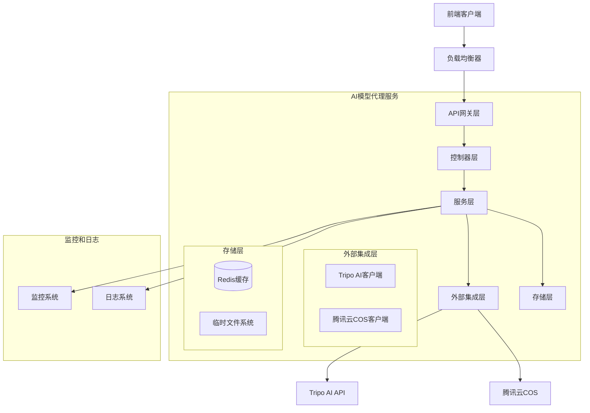

# 设计文档

## 概述

AI模型代理服务是一个基于Node.js和Express.js构建的RESTful API服务，采用现代化的微服务架构模式。该服务作为前端客户端与Tripo AI 3D模型生成服务之间的代理层，集成腾讯云COS进行文件存储管理。

系统采用分层架构设计，包含控制器层、服务层、数据访问层和外部集成层，确保代码的可维护性和可扩展性。通过Docker容器化部署，支持CI/CD自动化流水线，提供高可用性和可伸缩性。

## 架构

### 系统架构图



### 技术栈选择

**核心框架:**
- **Node.js 18+**: 运行时环境，提供优秀的异步I/O性能
- **Express.js 4.x**: Web框架，轻量级且灵活
- **TypeScript**: 类型安全的JavaScript超集，提高代码质量

**中间件和工具:**
- **Helmet**: 安全中间件，设置HTTP安全头
- **Compression**: 响应压缩中间件
- **Morgan**: HTTP请求日志中间件
- **Cors**: 跨域资源共享配置
- **Multer**: 文件上传处理中间件

**外部集成:**
- **Axios**: HTTP客户端，用于API调用
- **cos-nodejs-sdk-v5**: 腾讯云COS官方SDK
- **Redis**: 缓存和会话存储
- **Winston**: 结构化日志记录

**开发和部署:**
- **Docker**: 容器化部署
- **Docker Compose**: 本地开发环境编排
- **GitHub Actions**: CI/CD自动化
- **Swagger/OpenAPI 3.0**: API文档生成

## 组件和接口

### 控制器层 (Controllers)

**ModelController**
```typescript
interface ModelController {
  // 创建模型生成任务
  createModel(req: Request, res: Response): Promise<void>
  
  // 查询模型生成状态
  getModelStatus(req: Request, res: Response): Promise<void>
  
  // 获取模型结果
  getModelResult(req: Request, res: Response): Promise<void>
}
```

**HealthController**
```typescript
interface HealthController {
  // 健康检查端点
  healthCheck(req: Request, res: Response): Promise<void>
  
  // 就绪检查端点
  readinessCheck(req: Request, res: Response): Promise<void>
}
```

### 服务层 (Services)

**ModelGenerationService**
```typescript
interface ModelGenerationService {
  // 提交模型生成请求
  submitGenerationRequest(input: ModelInput, token: string): Promise<JobResponse>
  
  // 轮询作业状态
  pollJobStatus(jobId: string): Promise<JobStatus>
  
  // 处理完整的模型生成流程
  processModelGeneration(input: ModelInput, token: string): Promise<ModelResult>
}
```

**FileStorageService**
```typescript
interface FileStorageService {
  // 上传文件到COS
  uploadToCOS(file: Buffer, filename: string, metadata: FileMetadata): Promise<UploadResult>
  
  // 从URL下载文件
  downloadFromURL(url: string): Promise<Buffer>
  
  // 验证文件完整性
  validateFileIntegrity(file: Buffer, expectedHash?: string): Promise<boolean>
}
```

**CacheService**
```typescript
interface CacheService {
  // 缓存作业状态
  cacheJobStatus(jobId: string, status: JobStatus, ttl: number): Promise<void>
  
  // 获取缓存的作业状态
  getCachedJobStatus(jobId: string): Promise<JobStatus | null>
  
  // 清除作业缓存
  clearJobCache(jobId: string): Promise<void>
}
```

### 外部集成层 (External Integrations)

**TripoAIClient**
```typescript
interface TripoAIClient {
  // 提交生成请求
  submitRequest(input: TripoInput, token: string): Promise<TripoResponse>
  
  // 查询作业状态
  getJobStatus(jobId: string, token: string): Promise<TripoJobStatus>
  
  // 下载生成的模型
  downloadModel(downloadUrl: string): Promise<Buffer>
}
```

**TencentCOSClient**
```typescript
interface TencentCOSClient {
  // 上传文件
  putObject(params: COSUploadParams): Promise<COSUploadResult>
  
  // 生成预签名URL
  getSignedUrl(operation: string, params: COSParams): Promise<string>
  
  // 获取对象元数据
  headObject(params: COSParams): Promise<COSMetadata>
}
```

## 数据模型

### 请求和响应模型

**ModelGenerationRequest**
```typescript
interface ModelGenerationRequest {
  type: 'image' | 'text'
  input: string | Buffer  // 文本内容或图片数据
  token: string
  options?: {
    quality?: 'low' | 'medium' | 'high'
    format?: 'obj' | 'fbx' | 'gltf'
    timeout?: number
  }
}
```

**ModelGenerationResponse**
```typescript
interface ModelGenerationResponse {
  jobId: string
  status: 'pending' | 'processing' | 'completed' | 'failed'
  message: string
  estimatedTime?: number
  result?: {
    modelUrl: string
    thumbnailUrl?: string
    metadata: {
      fileSize: number
      format: string
      generationTime: number
      dimensions?: {
        width: number
        height: number
        depth: number
      }
    }
  }
  error?: {
    code: string
    message: string
    details?: any
  }
}
```

### 内部数据模型

**JobStatus**
```typescript
interface JobStatus {
  jobId: string
  status: 'pending' | 'processing' | 'completed' | 'failed'
  progress: number  // 0-100
  createdAt: Date
  updatedAt: Date
  completedAt?: Date
  tripoJobId?: string
  cosUrl?: string
  error?: ErrorInfo
}
```

**FileMetadata**
```typescript
interface FileMetadata {
  originalName: string
  mimeType: string
  size: number
  hash: string
  uploadedAt: Date
  cosKey: string
  cosUrl: string
}
```

## 正确性属性

*属性是一个特征或行为，应该在系统的所有有效执行中保持为真——本质上是关于系统应该做什么的正式声明。属性作为人类可读规范和机器可验证正确性保证之间的桥梁。*

现在我需要使用prework工具来分析验收标准的可测试性：
基于预工作分析，我将验收标准转换为可测试的正确性属性：

### 属性1：输入验证一致性
*对于任何*客户端请求，系统应当根据输入类型（图片、文本、令牌）应用相应的验证规则，接受有效输入并拒绝无效输入，返回适当的错误消息
**验证需求：1.1, 1.2, 1.3, 1.4**

### 属性2：支持的图片格式
*对于任何*JPEG、PNG或WebP格式的图片文件，系统应当接受并处理该文件
**验证需求：1.5**

### 属性3：外部API交互正确性
*对于任何*有效的模型生成请求，系统应当正确转发到Tripo AI，处理响应（成功或错误），并实现适当的超时和重试机制
**验证需求：2.1, 2.2, 2.3, 2.4, 2.5**

### 属性4：作业状态轮询行为
*对于任何*启动的模型生成作业，系统应当按配置间隔轮询状态，根据状态变化采取相应行动（继续轮询、检索模型或处理失败），并实现指数退避策略
**验证需求：3.1, 3.2, 3.3, 3.4, 3.5**

### 属性5：文件处理完整性
*对于任何*成功生成的模型，系统应当完整地下载文件、验证完整性、使用唯一文件名上传到COS、配置正确权限并存储URL
**验证需求：4.1, 4.2, 4.3, 4.4, 4.5**

### 属性6：响应格式一致性
*对于任何*API响应，系统应当返回一致的JSON结构，包含适当的元数据，使用正确的HTTP状态码，并在错误时提供详细信息
**验证需求：5.1, 5.2, 5.3, 5.4, 5.5**

### 属性7：RESTful设计合规性
*对于任何*API端点，系统应当遵循RESTful约定，使用适当的HTTP方法，保持一致的URL模式，并提供OpenAPI文档
**验证需求：6.1, 6.2, 6.3, 6.4**

### 属性8：配置管理有效性
*对于任何*环境配置，系统应当正确加载环境特定设置、安全管理凭证、应用超时和重试参数、执行上传限制，并在启动时验证配置有效性
**验证需求：7.1, 7.2, 7.3, 7.4, 7.5**

### 属性9：健康检查可用性
*对于任何*健康检查请求，系统应当返回正确的健康状态信息
**验证需求：8.3**

### 属性10：优雅关闭行为
*对于任何*关闭信号，系统应当优雅地完成正在进行的请求并安全关闭
**验证需求：8.4**

## 错误处理

### 错误分类和处理策略

**客户端错误 (4xx)**
- **400 Bad Request**: 无效的输入格式、缺少必需字段
- **401 Unauthorized**: 无效或缺失的认证令牌
- **413 Payload Too Large**: 上传文件超过大小限制
- **415 Unsupported Media Type**: 不支持的文件格式
- **429 Too Many Requests**: 请求频率限制

**服务器错误 (5xx)**
- **500 Internal Server Error**: 未预期的系统错误
- **502 Bad Gateway**: 外部服务（Tripo AI/COS）不可用
- **503 Service Unavailable**: 系统过载或维护中
- **504 Gateway Timeout**: 外部服务响应超时

### 错误响应格式

```typescript
interface ErrorResponse {
  error: {
    code: string           // 错误代码
    message: string        // 用户友好的错误消息
    details?: any         // 详细错误信息（开发环境）
    timestamp: string     // 错误发生时间
    requestId: string     // 请求追踪ID
  }
}
```

### 重试和熔断机制

**重试策略**
- 指数退避：初始延迟1秒，最大延迟60秒
- 最大重试次数：3次
- 可重试的错误：网络超时、5xx服务器错误
- 不可重试的错误：4xx客户端错误、认证失败

**熔断器模式**
- 失败阈值：连续5次失败
- 熔断时间：30秒
- 半开状态：允许1个请求测试服务恢复

## 测试策略

### 双重测试方法

**单元测试**
- 验证特定示例和边缘情况
- 测试错误条件和异常处理
- 集成点测试
- 使用Jest测试框架
- 目标覆盖率：90%以上

**基于属性的测试**
- 验证通用属性在所有输入中成立
- 使用fast-check库进行随机输入生成
- 每个属性测试最少100次迭代
- 标签格式：**Feature: ai-model-proxy, Property {number}: {property_text}**

**测试配置**
- 测试环境使用Docker容器隔离
- 模拟外部服务（Tripo AI、COS）
- 使用测试数据库和缓存实例
- 自动化测试在CI/CD流水线中运行

### 集成测试

**API端到端测试**
- 完整的请求-响应流程测试
- 外部服务集成测试
- 文件上传和下载流程测试
- 错误场景和恢复测试

**性能测试**
- 负载测试：并发用户和请求处理
- 压力测试：系统极限和恢复能力
- 内存和CPU使用监控
- 响应时间和吞吐量基准

### 监控和可观测性

**日志记录**
- 结构化日志（JSON格式）
- 请求追踪ID
- 性能指标记录
- 错误堆栈跟踪

**指标监控**
- 请求计数和响应时间
- 错误率和成功率
- 外部服务调用指标
- 系统资源使用情况

**健康检查**
- 应用程序健康状态
- 外部依赖可用性
- 数据库连接状态
- 缓存服务状态